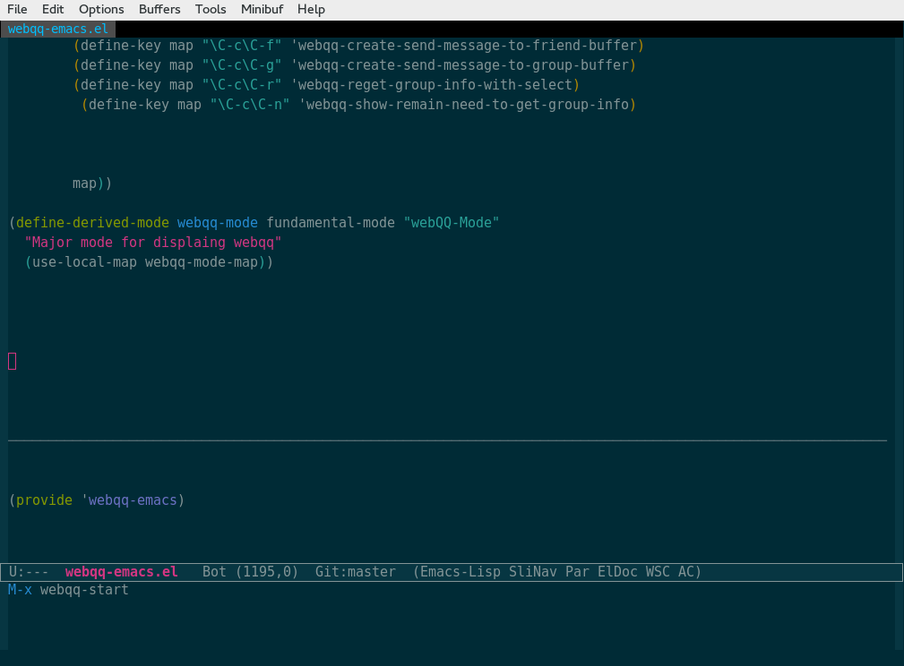
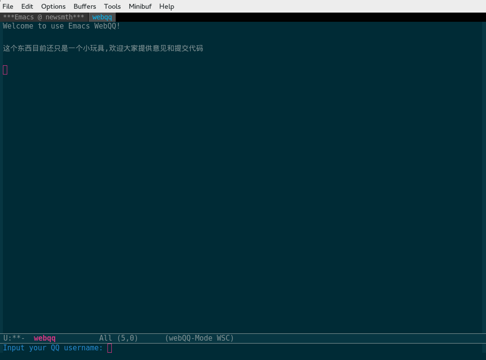
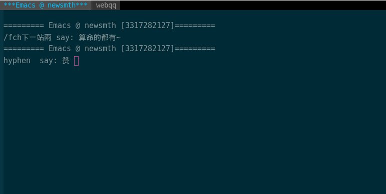

webqq-emacs
===========

This is a webqq plugin for Emacs


使用前需要的配置
======================================
1. 系统需要安装curl md5deep 软件包. Debian/Ubuntu系统请使用下面命令.

```
apt-get install curl md5deep
```

2. 将webqq-emacs.el添加到emacs的加载环境中.

3. 项目依赖于 `json.el` `url.el` `cl.el` `pp.el` `async.el`(emacs-async)

4. 会下载一些临时文件,默认的保存路径是`~/.webqq/`

可以自行修改代码


介绍
============================================

启动


输入用户名和密码


群信息



使用
===========================================
1. `M- webqq-start` 启动
2. 输入用户名 密码 (有可能会需要输入验证码)
3. 使用`C-c n` 察看没有更新好的群列表 , 光标移动到群id使用`C-c r`手动更新群信息
4. `M- show-friend-list` 显示好友列表, 展开分组选择好友可以聊天 输入`C-c`发送消息
5. 使用`M- show-group-list`显示群组列表, 选择后可以进行聊天 输入`C-c`发送消息
6. 当接收到好友新的消息时,打开相应`buffer` 输入`C-c C-f` 创建聊天输入框 输入`C-c`发送消息
7. 当接收到群组新的消息时,打开相应`buffer` 输入`C-c C-g` 创建聊天输入框 输入`C-c`发送消息


Bugs List
======================================
1. 登录的时候会获取用户的好友列表和群列表,比较消耗时间, Emacs会有假死的感觉,可以通过察看日志信息判断是否依然正常.

2. *网络不稳定时常常断线* 暂时还没有断线重新连接的功能

3. 还没有支持临时会话和讨论组

4. *发送暂时不支持多行(需要修复)*

5. *表情显示有错误(以后修复)*

6. *如果好友列表有昵称相同消息发送会出问题*


欢迎
========================================
欢迎大家提交issue和代码


感谢
============================================
感谢iQQ所做的工作, 网络协议相关的工作都是直接从该项目代码中获得的, 偶尔使用wireshark进行数据包分析, 但是iQQ省去了我大量的协议分析工作.
